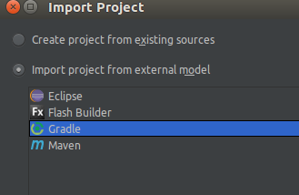
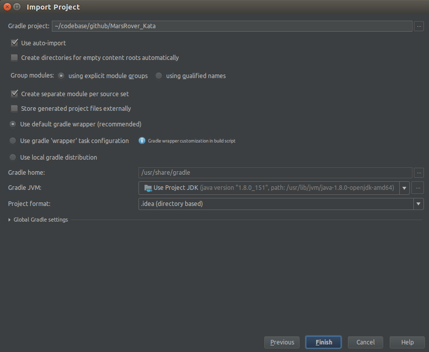

Mars Rover Kata
===============

You’re part of the team that explores Mars by sending remotely controlled vehicles to the surface of the planet. 
Develop an api that moves a rover around on a grid.

## Requirements
* You are given the initial starting point (x,y) of a rover and the 
direction (N,S,E,W) it is facing.
* The rover receives a character array of commands.
* Implement commands that move the rover forward/backward (f,b).
* Implement commands that turn the rover left/right (l,r).
* Implement wrapping from one edge of the grid to another. (planets are spheres after all)
* Implement obstacle detection before each move to a new square. 
If a given sequence of commands encounters an obstacle, the rover moves up 
to the last possible point and reports the obstacle.

## Rules
* Hardcore TDD. No Excuses!
* Change roles (driver, navigator) after each TDD cycle.
* No red phases while refactoring.
* Be careful about edge cases and exceptions. We can not afford to lose a mars rover, just 
because the developers overlooked a null pointer.

## Source
- http://kata-log.rocks/mars-rover-kata
- https://github.com/vfarcic/mars-rover-kata-java

## Getting started
You can use your favourite programming language, unit test and mocks libraries.

This repo also includes a starting project for Java 8, JUnit, AssertJ and Mockito to help 
you getting started.

Clone or [download](https://github.com/Cork-Software-Craftsmanship-Community/MarsRover_Kata/archive/master.zip) this 
project, import it in your IDE as a Gradle project, and start TDDing ;-)





If you want to run the unit tests directly from the console do a
```
$ ./gradlew test
```


